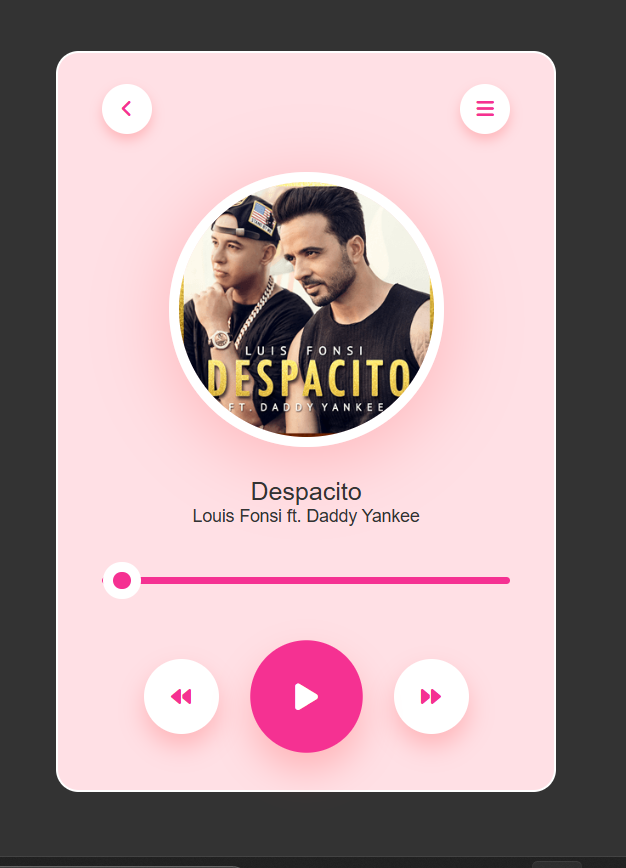

# Music Player 🎶

A simple and stylish music player built with HTML, CSS, and JavaScript. The player includes a custom-designed UI with controls for playing, pausing, skipping, and tracking the progress of the song.

 

## Features
- Play and pause functionality
- Progress bar that tracks the song's current time
- Custom control icons using Font Awesome
- Visual effects and styling with CSS

## Technologies Used
- **HTML**: Structure of the music player and audio element.
- **CSS**: Styling for the player, including custom buttons, progress bar, and animations.
- **JavaScript**: Logic to control playback, toggle icons, and update the progress bar.

